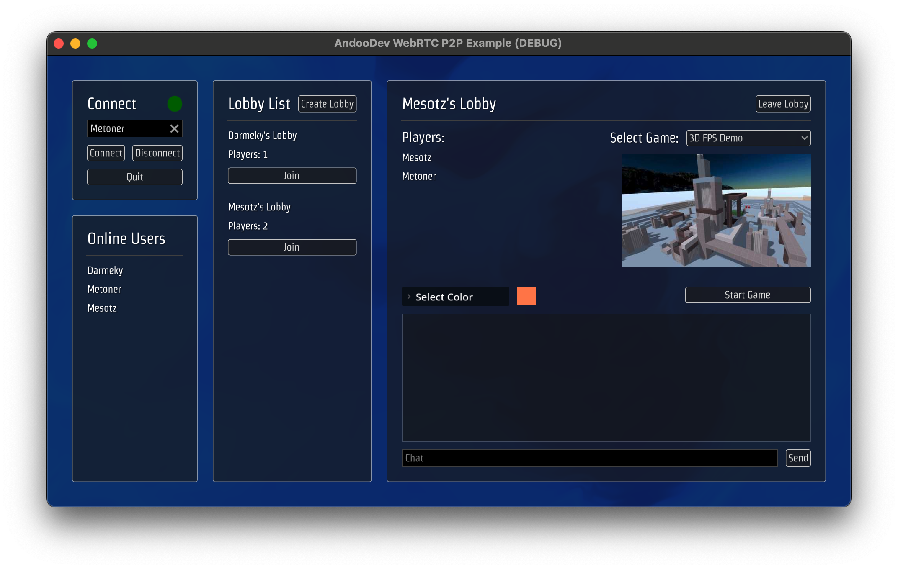
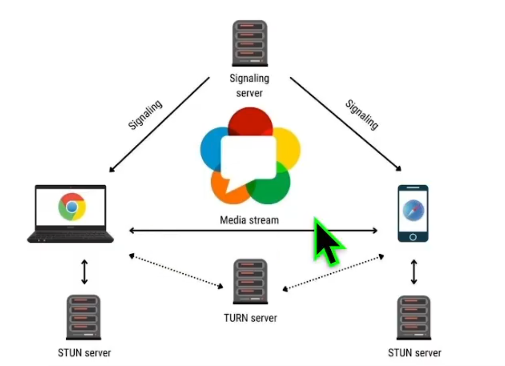
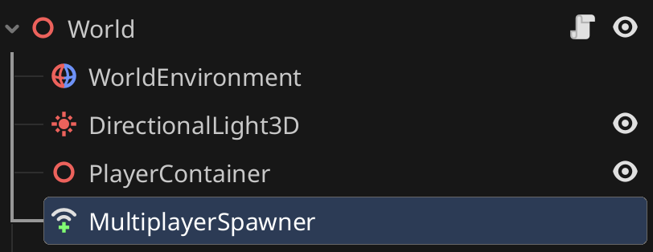

# andoodev-godot-web-rtc-p2p

> "All I ever wanted was for someone to say: 'This guy's cracked'"

|                        |                                |                              |
| :--------------------: | :----------------------------: | :--------------------------: |
|  | https://www.twitch.tv/andoodev | https://x.com/andrewdavisdev |

## Realtime peer-to-peer, no server, no issues

> ### Have you ever wanted to simply join a multiplayer game with friends? Have 2 or more people just run the game & instantly connect?

- No issues.
- No server.
- In a browser.

This is it. `andoodev-godot-web-rtc-p2p` is a complete peer-to-peer multiplayer Godot project. It features a full lobby system (in Websockets) and demo FPS game with drop-in-drop-out mesh networking. It even runs in the browser. It's the perfect way to do multiplayer for game jams or other lightweight projects.

|             Lobby              |            In Game             |
| :----------------------------: | :----------------------------: |
|  |  |

## How to:

- Link to game: https://jonandrewitchio.itch.io/andoodev-web-rtc-p2p (Chrome loads fastest)
- Connect
- Create Lobby
- Send your friend the same link
- They join
- Start game (requires at least 2 players)
- (you can even have players join in-progress)

## Godot P2P with WebRTC

[WebRTC](https://webrtc.org/) is a connection protocol that allows direct peer-to-peer transfer for video, audio, and of course, games! (Zoom and other tech is built on it.) One of the most common problems with multiplayer is NAT or Firewall punchthrough. Today's routers have modern rules that make it difficult to connect and expose traffic, especially for UDP and realtime gaming. Most solutions rely on:

- A dedicated server hosted in the cloud
- A "relay" server

WebRTC uses neither of these\*\*! Instead, it uses "Session Traversal Utilities for NAT" (STUN), to establish a direct connection between two clients [source](https://developer.liveswitch.io/liveswitch-server/guides/what-are-stun-turn-and-ice.html). Once connected, the clients are good to swap UDP packets directly and they're off to the races! No server needed after that! Godot supports this as [WebRTCMultiplayerPeer](https://docs.godotengine.org/en/4.4/classes/class_webrtcmultiplayerpeer.html#class-webrtcmultiplayerpeer), a drop in replacement for `ENetMultiplayerPeer`.

\*\* STUN is used in like 97% of cases, but TURN may relay with older connections involved, some mobile 3G, etc. See footnotes.

## The Signaling Server

While WebRTC is indeed true, direct P2P, it's not easy to get the clients ready to connect. _We still need a central gathering place to swap the connection info_! This means we need what's called a "signaling server", which is essentially a chat app where clients can talk to each other about WebRTC. This project includes a `LobbySystem` written in TypeScript (planning to re-write in Go) where players can join and start the WebRTC session.

## Feature List

- Fully featured `LobbySystem`
- Current user list
- Lobby list
- Join, create, leave lobbies
- Lobby chat
- Color picker

##### First Person Shooter Demo

- Leaderboard
- In Game Chat
- Drop-in, Drop-out joining (quit, rejoin, etc.)
- 2 weapons
- Sounds, hit registration
- Projectile spawning (in-progress) example
- Map Selector (in-progress)
- 3rd person option (present, but in-progress)
- Add grenades, explosives, more ragdolls, melee attacks (to-do)

# Local Install and Set up:

### Godot Client:

- Open Godot (4.5)
- Import
- Select `godot-client/project.godot`
- Set 2 debug instances
- Play

### Websockets server:

- Pre-req: node, npm, yarn
- `npm install -g corepack`
- (might need `yarn set version 4.5`)

- Clone this repository
- open `typescript-websockets-lobby`
- run `yarn`
- run `yarn start`

##### Cloudflare:

- Fork this repo
- Log in to Cloudflare
- Create a new worker & point the new repository
- Once ready, update the `SECRET_KEY`
- For detailed self hosting instructions on Cloudflare, see: [typescript-websockets-lobby README](typescript-websockets-lobby/README.md)

##### Export Godot Game to itch.io:

- Create /dist
- Export HTML5:
  - make sure to enable extensions (webrtc folder has an extension in it...)
  - Tell file name to be dist/index.html (helps because its in .gitingore)
- upload zip or: [butler](https://itch.io/docs/butler/)
- `butler push dist jonandrewitchio/andoodev-web-rtc-p2p:html5` (don't use this one, that's me, use your name & game)

# How to Use in Your Game

- Copy the `lobby` folder into your game from `godot_client/lobby`
- Add `lobby_system.gd` as an Autoload
  - To do this:
  - Project -> Project Settings
  - Choose "Globals" Tab
  - Path: Click the folder and navigate to `lobby/lobby_system.gd`
  - Node Name: LobbySystem
  - Add
  - Enable it
- Restart the project
- In your main scene, hit CRTL + SHIFT + A for adding an existing scene
- Search for "LobbyMenu" and add it
  - Or search for "LobbyQuickJoin" if you prefer that version
- Add some signals to your main scene like: [main.gd](godot-client/main.gd) that will add the game scene or "World" when the game starts
- Add some signals to your game scene or "World" as I call it like [world.gd](godot-client/game/world/world.gd) to add and remove players
- Add your MultiplayerSpawner and player scene in the Autospawn of it

|           Main.tscn            |               World.tscn               |
| :----------------------------: | :------------------------------------: |
|  |  |
|                                |

- (Alternatively, you could use this project & delete the `game` folder and drop your own `World` in)

## Assets, Resources, and Thanks!:

- FPS Weapons Demo: https://github.com/Jeh3no/Godot-Simple-FPS-Weapon-System-Asset (stripped down)
- Godot Example project: https://github.com/godotengine/godot-demo-projects/tree/master/networking
- Model by Mixamo: [Vanguard By T. Choonyung](https://www.mixamo.com/#/?page=1&type=Character)
- Weapon Models by https://poly.pizza/m/1vBdqOfUNd https://x.com/quaternius
- Awesome Map by skywalk1411 - https://kirka.lukeskywalk.com/mapeditor/
- Special thanks to BatteryAcidDev https://www.youtube.com/@BatteryAcidDev
- Special thanks to Netfox discord https://github.com/foxssake/netfox

TODO: detailed documentation of assets, strip resources, sounds (https://pixabay.com/sound-effects is the sound source, but ned to doc). Note: LICENCE in this repo does not apply to these. I know how that's not how it works, but just what I've done temporarily, do not distribute, etc. etc. I'm new to open source, sorry, work in progres, please contact if there any issues.

## Contributing

Best way to contribute would be assets & sounds, to help make this project more open-source friendly. Looking for collaborators on 3D multiplayer games! Reach out!

## Helpful Documentation:

- https://docs.godotengine.org/en/4.4/classes/class_webrtcmultiplayerpeer.html
- https://developer.mozilla.org/en-US/docs/Glossary/WebRTC
- https://developer.liveswitch.io/liveswitch-server/guides/what-are-stun-turn-and-ice.html

## STUN and TURN

STUN is almost always used, but there may be exceptions when relaying needs to occur. In this case, TURN can take over.

Definitions:

- Session Traversal Utilities for NAT (STUN) - Used to establish a direct UDP connection between two clients.
- Traversal Using Relay around NAT (TURN) - Used to establish a relayed UDP or TCP connection between two clients. Here, the traffic must be relayed through the TURN server to bypass restrictive firewall rules, and the preference is UDP over TCP because TCP's guaranteed ordered delivery of packets implies overhead that is undesirable for real-time communications.

Cloudflare will do this: https://developers.cloudflare.com/realtime/turn/ cheaply and effectively.
